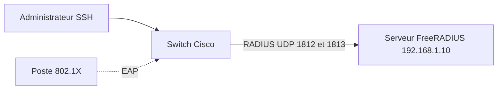

# Lab sécurité : authentification centralisée avec FreeRADIUS

> **Statut : à réaliser.** Ce guide est préparé à partir de la documentation officielle et de mes cours ; **je ne l'ai pas encore rejoué de bout en bout**. Les commandes sont à valider en le faisant, et le journal en bas de page sera complété avec mes résultats réels (captures, erreurs rencontrées, corrections).
>
> **Commandes vérifiées :** ce guide a été rejoué dans un conteneur Debian 13 (22 septembre 2026) avec le vrai FreeRADIUS : `freeradius -C` valide la configuration, le serveur démarre en mode debug et charge le client `sw1`, et `radtest` confirme un `Access-Accept` avec le bon mot de passe, un `Access-Reject` avec un mauvais mot de passe, avec un utilisateur inconnu, et avec un secret partagé incorrect. La partie 802.1X (matériel réel requis) n'a pas pu être vérifiée. Vérifié ne veut pas dire réalisé : c'est l'assistant IA qui a préparé ce guide qui a rejoué ces commandes dans un conteneur jetable, pas moi sur mon propre lab. Le journal ci-dessous reste à remplir une fois que je l'aurai fait moi-même.

## Objectif

Centraliser l'authentification avec un serveur **RADIUS** (FreeRADIUS) : les comptes sont gérés à un seul endroit, et un équipement réseau (switch ou routeur) leur demande de valider les connexions.

Deux parties :

- **A. Authentification de l'administrateur** sur un routeur ou un switch Cisco (SSH), avec un compte local en secours ;
- **B. 802.1X** (contrôle d'accès des postes sur un port de switch) — nécessite un switch réel ou un simulateur qui l'implémente ; Packet Tracer ne gère pas complètement 802.1X.

## Prérequis

- Une machine **Debian 12** pour FreeRADIUS et un équipement Cisco (réel ou virtuel).
- Notions : AAA (authentification, autorisation, traçabilité), secret partagé.

## Topologie



## Étapes

### 1. Installer et tester FreeRADIUS

```bash
sudo apt update && sudo apt install -y freeradius freeradius-utils
```

Déclarer un utilisateur de test dans `/etc/freeradius/3.0/users` (en **tête** du fichier, avant les entrées par défaut) :

Fichier du dépôt : [`configs/users.extrait`](configs/users.extrait)

```text
alice   Cleartext-Password := "MotDePasseLab-Alice1"
```

Déclarer le switch comme client RADIUS dans `/etc/freeradius/3.0/clients.conf` :

Fichier du dépôt : [`configs/clients.conf.extrait`](configs/clients.conf.extrait)

```text
client sw1 {
    ipaddr = 192.168.1.2
    secret = SecretPartageLab2026
}
```

Lancer le serveur en **mode debug** pour voir chaque échange (arrêter d'abord le service) :

```bash
sudo systemctl stop freeradius
sudo freeradius -X
```

Dans un second terminal, tester en local (le client `localhost` a pour secret `testing123` par défaut) :

```bash
radtest alice MotDePasseLab-Alice1 127.0.0.1 0 testing123
```

Résultat attendu : `Received Access-Accept`. Avec un mauvais mot de passe : `Access-Reject`.

### 2. Partie A : le switch demande à RADIUS

Fichier du dépôt : [`configs/sw1-radius.txt`](configs/sw1-radius.txt)

```text
configure terminal
username secours privilege 15 secret MotDePasseSecoursLab1
aaa new-model
radius server LAB-RADIUS
 address ipv4 192.168.1.10 auth-port 1812 acct-port 1813
 key SecretPartageLab2026
aaa authentication login default group radius local
aaa authorization exec default group radius local
line vty 0 4
 transport input ssh
end
write memory
```

`group radius local` : le switch interroge d'abord RADIUS, et n'utilise le compte **local** (`secours`) que si le serveur ne répond pas — sans cela, un serveur RADIUS en panne verrouille l'administrateur. Prérequis : SSH activé sur le switch (`hostname`, `ip domain-name`, `crypto key generate rsa`).

### 3. Partie B : 802.1X sur un port d'accès (matériel réel)

Fichier du dépôt : [`configs/sw1-dot1x.txt`](configs/sw1-dot1x.txt)

```text
configure terminal
dot1x system-auth-control
aaa authentication dot1x default group radius
interface f0/5
 switchport mode access
 authentication port-control auto
 dot1x pae authenticator
end
```

Un poste configuré avec un client 802.1X (Windows : service *Configuration automatique de réseau filaire*) s'authentifie avant d'obtenir un accès réseau. Pour un vrai déploiement, on utilise EAP-TLS ou PEAP avec certificats (voir [pki-interne-openssl](https://github.com/mehdiseg/pki-interne-openssl)) plutôt qu'un mot de passe en clair.

## Vérifications

- `radtest` renvoie `Access-Accept` pour `alice` et `Access-Reject` avec un mauvais mot de passe.
- Le mode debug de FreeRADIUS affiche la requête du switch (`Received Access-Request ... from client sw1`).
- Connexion SSH au switch avec le compte `alice` : accès accordé ; avec le serveur arrêté : le compte `secours` fonctionne.
- Sur le switch : `show aaa servers` (état du serveur RADIUS), et `show authentication sessions` en 802.1X.

## Pièges fréquents

- Secret différent sur le serveur et sur l'équipement : `Access-Reject` ou aucune réponse, avec un message « shared secret » en mode debug.
- Adresse source de l'équipement différente de celle déclarée dans `clients.conf`.
- Pare-feu qui bloque UDP 1812/1813.
- Compte de secours oublié : perte d'accès à l'équipement en cas de panne du serveur.
- `Cleartext-Password` : acceptable en labo, à remplacer en production par une base d'annuaire (LDAP / Active Directory).

## Pour aller plus loin

- Brancher FreeRADIUS sur un annuaire (LDAP ou Active Directory).
- Affecter dynamiquement un **VLAN** selon l'utilisateur (attributs `Tunnel-Type`, `Tunnel-Private-Group-Id`).
- Utiliser un serveur RADIUS pour l'authentification Wi-Fi WPA2/WPA3 Enterprise.

## Références

- [Documentation de FreeRADIUS](https://freeradius.org/documentation/)
- [Wiki de FreeRADIUS](https://wiki.freeradius.org/)
- [RFC 2865 : Remote Authentication Dial In User Service (RADIUS)](https://www.rfc-editor.org/rfc/rfc2865)

## Journal de réalisation

_Lab pas encore réalisé : cette section sera remplie au fur et à mesure._

| Date | Ce que j'ai fait | Résultat | Difficultés et solutions |
|---|---|---|---|
|  |  |  |  |

## Feuille de route

Ce lab fait partie de ma [feuille de route réseau](https://github.com/mehdiseg/roadmap-reseau-bts-sio).

## Licence

[MIT](LICENSE)
